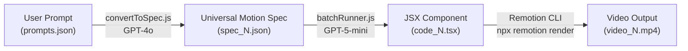
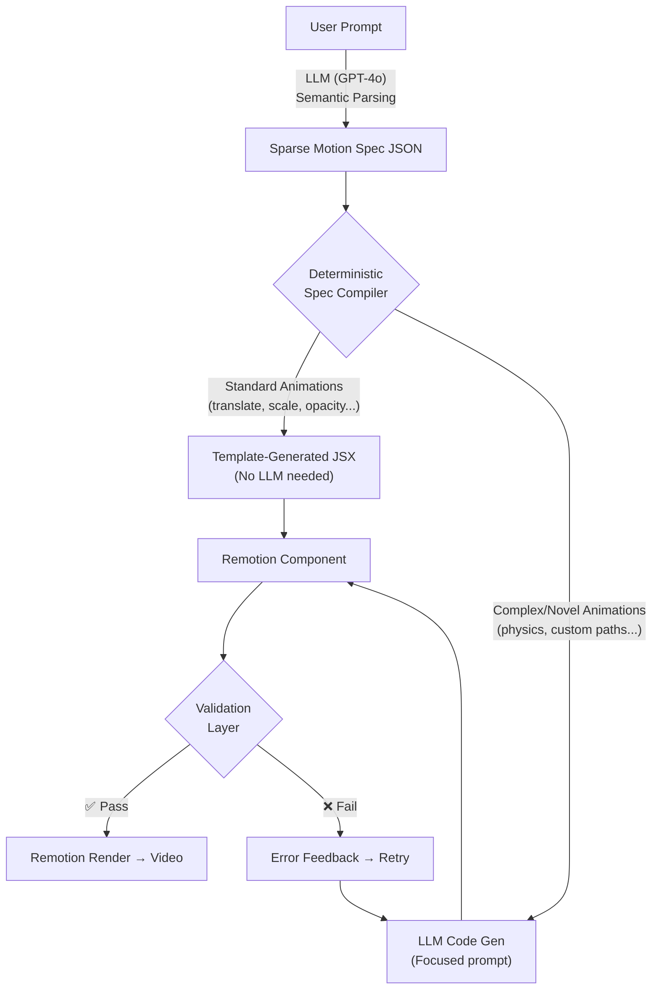
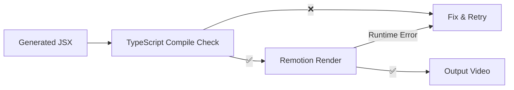
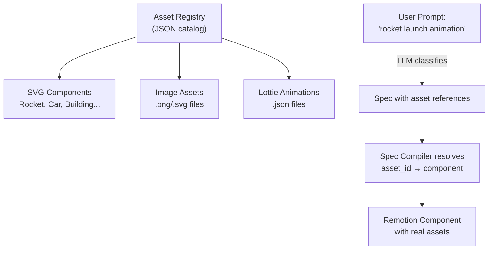

# Shape-Motion-Lab: Architecture Analysis & Roadmap

## 1. Current Pipeline Deep-Dive

Your pipeline has three stages, each with distinct strengths and weaknesses:



| Stage | Script | Model | Input Size | Output Size |
|---|---|---|---|---|
| Prompt → Spec | [convertToSpec.js](file:///Users/durgesh/Desktop/shape-motion-lab/scripts/convertToSpec.js) | GPT-4o (temp=0) | ~200 words | 6KB–35KB |
| Spec → Code | [batchRunner.js](file:///Users/durgesh/Desktop/shape-motion-lab/scripts/batchRunner.js) | GPT-5-mini | 6KB–35KB + 270-line system prompt | ~250 lines JSX |
| Code → Video | Remotion CLI | N/A (deterministic) | JSX component | MP4 |

---

## 2. Critical Weaknesses Identified

### Weakness 1: Massive Spec Bloat (Root Cause of Level 1.2 Failures)

> [!CAUTION]
> This is the single biggest problem in your pipeline. The spec schema forces **every field to be present**, even when unused. This causes exponential bloat.

**Evidence from your codebase:**

| Spec | Objects | Animations | Lines | Bytes | Useful Data |
|---|---|---|---|---|---|
| [spec_1.json](file:///Users/durgesh/Desktop/shape-motion-lab/machine_specs/spec_1.json) (Level 1.0) | 1 | 2 | 292 | 6,236 | ~15% |
| [spec_51.json](file:///Users/durgesh/Desktop/shape-motion-lab/machine_specs/spec_51.json) (Level 1.1) | 1 | 4 | 556 | 12,198 | ~10% |
| [spec_101.json](file:///Users/durgesh/Desktop/shape-motion-lab/machine_specs/spec_101.json) (Level 1.2) | 3 | 12+ | 1,612 | 35,526 | ~8% |

A simple "Circle Fade In" animation (1 object, 1 fade) produces **6KB / 292 lines** of JSON. Over 85% is empty strings, zeroed numbers, and unused nested objects like `morph`, `shatter`, `extrude`, `dash_pattern`, `gradient_flow` — none of which are needed for a fade.

For Level 1.2 prompts with 8-16 objects and 20+ animation phases, spec sizes would be **100KB–200KB**. This overwhelms the LLM's context window and causes the accuracy degradation you observed.

### Weakness 2: Monolithic System Prompt for Code Generation

The [batchRunner.js system prompt](file:///Users/durgesh/Desktop/shape-motion-lab/scripts/batchRunner.js#L60-L269) is **270 lines** of accumulated workaround rules. It includes:
- 17+ "CRITICAL" rules (line centering, polygon stroke draw, dashed lines, diagonal math, oscillation timing, bar chart anchoring...)
- Each rule was added reactively to fix a specific error (evidenced by [errors_tracing.json](file:///Users/durgesh/Desktop/shape-motion-lab/errors_tracing.json))
- Rules contradict each other (e.g., "use `translate(-50%, -50%)`" for centering vs. "NEVER use `translate(-50%, -50%)`" for lines)

This growing rule set will become increasingly fragile as complexity increases.

### Weakness 3: No Programmatic Spec → Code Layer

The entire spec-to-code translation is done by the LLM. There is **no deterministic code between spec and output**. This means:

- A simple `translate` animation with known start/end frames could be generated deterministically with a template, but instead requires a full LLM inference
- Every `interpolate()` call, every positioning calculation, every frame timing conversion is left to the LLM to generate correctly
- The LLM must simultaneously handle: frame math, Remotion API, positioning logic, animation sequencing, and string concatenation rules

### Weakness 4: No Validation or Feedback Loop

From [batchRunner.js](file:///Users/durgesh/Desktop/shape-motion-lab/scripts/batchRunner.js#L325-L350), validation is limited to:
- Checking for template literal `${` syntax (retry up to 2 times)
- Checking for `for(` loops
- A regex check for `const` reassignment
- A regex check for RGB array interpolation

There is no:
- JSX/TypeScript compilation check before rendering
- Runtime error catching from Remotion
- Visual comparison or output validation
- Spec-to-output verification (does the rendered video match the spec?)

### Weakness 5: Single-File Architecture

All generated code is written to the same [GeneratedMotion.tsx](file:///Users/durgesh/Desktop/shape-motion-lab/src/GeneratedMotion.tsx) and [Root.tsx](file:///Users/durgesh/Desktop/shape-motion-lab/src/Root.tsx), overwritten for each prompt. This means:
- No parallel rendering
- No caching or reuse
- Race conditions if multiple processes run

### Weakness 6: Schema Inconsistency Across Levels

The [convertToSpec.js](file:///Users/durgesh/Desktop/shape-motion-lab/scripts/convertToSpec.js) schema definition is embedded as a string literal in the script. But the actual output specs ([spec_1.json](file:///Users/durgesh/Desktop/shape-motion-lab/machine_specs/spec_1.json) vs [spec_101.json](file:///Users/durgesh/Desktop/shape-motion-lab/machine_specs/spec_101.json)) show the LLM silently evolves the schema — adding fields like `text`, `layout`, `physics`, `sequence` that aren't in the original schema template. This causes downstream parsing issues.

### Weakness 7: No Path to Real-World Objects

The current pipeline only supports `div` elements with CSS properties. There is no mechanism for:
- SVG or canvas-based rendering
- Image/asset integration
- Component libraries
- Scene composition

---

## 3. Proposed Spec Schema Redesign: Sparse + Compositional

> [!IMPORTANT]
> The core insight: **only include fields that are actually used**. This alone would reduce spec sizes by 80–90%.

### Current Approach (Dense Schema)
Every animation block includes ALL possible fields, whether used or not:
```json
{
  "transform": { "translate": {...}, "rotate_deg": {...}, "scale": {...}, "opacity": {...}, "corner_radius_px": {...}, "skew_deg": {...} },
  "style_transition": { "color": {...}, "shadow": {...}, "glow": {...}, "gradient_flow": {...} },
  "stroke_draw": {...},
  "dash_pattern": {...},
  "advanced_actions": { "morph": {...}, "split": {...}, "shatter": {...}, "orbit": {...}, "extrude": {...} }
}
```

### Proposed Approach (Sparse Schema)
Only include what is actually animated:
```json
{
  "id": "anim_1",
  "target": "circle_1",
  "time": [0, 1.2],
  "easing": "ease-out",
  "opacity": [0, 1]
}
```

```json
{
  "id": "anim_2",
  "target": "circle_1",
  "time": [0, 2],
  "easing": "bounce",
  "x": [-960, 0],
  "y": [-540, 0]
}
```

```json
{
  "id": "anim_3",
  "target": "circle_1",
  "time": [2, 4],
  "orbit": { "center": [0, 0], "radius": 180, "degrees": 360 }
}
```

**Size comparison for the same "Circle Fade In" animation:**

| | Dense (Current) | Sparse (Proposed) |
|---|---|---|
| Lines | 292 | ~35 |
| Bytes | 6,236 | ~600 |
| Noise ratio | ~85% empty | ~0% |

**For a Level 1.2 "Complex Coordinated Finale" (9 objects, 12s timeline):**

| | Dense (Estimated) | Sparse (Estimated) |
|---|---|---|
| Lines | ~4,000+ | ~200–300 |
| Bytes | ~100KB+ | ~5–8KB |

### Sparse Schema Specification

```json
{
  "scene": "complex_finale",
  "duration": 12,
  "fps": 30,
  "canvas": { "w": 1920, "h": 1080 },
  "bg": "#000000",

  "objects": [
    {
      "id": "center_circle",
      "shape": "circle",
      "diameter": 200,
      "stroke": { "color": "#FFD700", "width": 4 },
      "fill": false,
      "pos": [0, 0]
    },
    {
      "id": "tri_1",
      "shape": "triangle",
      "size": [100, 100],
      "color": "#FF0000",
      "pos": [240, 0],
      "rotation": 0,
      "opacity": 0
    }
  ],

  "timeline": [
    { "target": "center_circle", "time": [0, 2], "scale": [1, 1.1, 1], "easing": "ease-in-out" },
    { "target": "tri_1", "time": [2, 2.5], "opacity": [0, 1] },
    { "target": "tri_1", "time": [6, 8], "rotation": [0, 180] },
    { "target": "tri_1", "time": [8, 10], "orbit": { "center": [0, 0], "radius": 240, "degrees": 90 } },
    { "target": "tri_1", "time": [10, 12], "pos": [[240, 0], [0, 0]], "opacity": [1, 0] }
  ]
}
```

**Key Design Principles:**
1. **Only active properties appear** — if scale isn't animated, it's not in the animation block
2. **Compact arrays instead of nested objects** — `"time": [0, 2]` instead of `"start_sec": 0, "end_sec": 2`
3. **Implicit defaults** — if `fill` isn't specified, it's `true`; if `pos` isn't specified, it's `[0, 0]`
4. **Multi-value keyframes** — `"scale": [1, 1.1, 1]` with `"time": [0, 1, 2]` for multi-phase animations
5. **Flat animation properties** — `"opacity": [0, 1]` instead of `"transform": { "opacity": { "from": 0, "to": 1 } }`

---

## 4. Proposed Architecture: Hybrid Deterministic + LLM

> [!IMPORTANT]
> The key architectural change: **introduce a deterministic rendering layer** between the spec and Remotion, using the LLM only for what it's good at (semantic understanding) and templates for what can be computed.



### Layer 1: Deterministic Spec Compiler

A Node.js module that converts spec JSON directly to Remotion JSX code for **all standard animations**:

| Animation Type | Deterministic? | Why |
|---|---|---|
| Translate (A→B) | ✅ Yes | `interpolate(frame, [start, end], [fromX, toX])` |
| Scale | ✅ Yes | Same pattern |
| Opacity | ✅ Yes | Same pattern |
| Rotation | ✅ Yes | Same pattern |
| Color transition | ✅ Yes | RGB channel interpolation |
| Staggered sequences | ✅ Yes | Loop with offset calculation |
| Orbit | ✅ Yes | Trigonometric formula |
| Spring/bounce easing | ✅ Yes | Remotion `spring()` API |
| Multi-phase keyframes | ✅ Yes | Chained `interpolate()` calls |
| Shape rendering | ✅ Yes | CSS `borderRadius`, `clipPath` |

This covers **~90% of your current prompt dataset** without any LLM involvement in code generation.

### Layer 2: LLM Fallback for Complex Patterns

For animations that require creative interpretation:
- Custom physics simulations
- Particle effects
- Novel visual effects not covered by templates

The LLM receives a **focused, minimal prompt** instead of the 270-line monolith:
```
Generate ONLY the animation calculation for this specific effect:
- Object: circle_1, 140px diameter
- Effect: bounce physics with gravity
- Time: frames 0-150
- Bounces at y=500px, heights: [300, 180, 60]
- Return only the interpolation variables, not the full component.
```

### Layer 3: Validation Layer



Steps:
1. **Syntax check**: Run `tsc --noEmit` on the generated component
2. **Structural check**: Verify single `AbsoluteFill` root, valid `interpolate()` calls
3. **Runtime check**: Wrap Remotion render in try/catch, capture error output
4. **On failure**: Feed error message back to LLM with the code for targeted fix

---

## 5. Staged Roadmap

### Phase 1: Quick Wins (1–2 weeks)
*Improvements with minimal architecture changes*

- [ ] **Switch to sparse spec schema** — Update [convertToSpec.js](file:///Users/durgesh/Desktop/shape-motion-lab/scripts/convertToSpec.js) system prompt to produce compact JSON. Remove the `SCHEMA` constant; instead provide 3 examples of sparse specs as few-shot prompts
- [ ] **Add TypeScript compilation validation** — Before `npx remotion render`, run `npx tsc --noEmit src/GeneratedMotion.tsx` and retry on failure
- [ ] **Add error capture to Remotion render** — Wrap `execSync` in try/catch, capture stderr, log to [errors_tracing.json](file:///Users/durgesh/Desktop/shape-motion-lab/errors_tracing.json) automatically
- [ ] **Split the monolithic system prompt** — Create separate prompt modules loaded conditionally based on spec content (e.g., only load "orbit rules" if spec contains orbit animations)
- [ ] **Parametric Root.tsx** — Pass `durationInFrames`, `width`, `height` as environment variables instead of rewriting [Root.tsx](file:///Users/durgesh/Desktop/shape-motion-lab/src/Root.tsx) for each prompt

### Phase 2: Deterministic Renderer (2–4 weeks)
*Build the spec compiler to eliminate LLM from standard animations*

- [ ] **Build `specCompiler.js`** — A Node.js module that reads sparse spec JSON and outputs valid Remotion JSX
  - Start with: translate, scale, opacity, rotation
  - Add: color interpolation, staggered sequences
  - Add: orbit, spring easing, multi-phase keyframes
- [ ] **Hybrid pipeline integration** — Modify [batchRunner.js](file:///Users/durgesh/Desktop/shape-motion-lab/scripts/batchRunner.js) to attempt deterministic compilation first, fall back to LLM only for unsupported animation types
- [ ] **Parallel rendering** — Generate components in isolated temp directories, render in parallel with `Promise.all`
- [ ] **Re-test all 150 prompts** — Compare accuracy against current results

### Phase 3: Asset & Scene Support (4–8 weeks)
*Enable real-world objects and composition*

- [ ] **SVG shape library** — Create a registry of pre-built SVG components (rocket, car, bus, trees, buildings) as Remotion components
- [ ] **Asset pipeline** — Support `` and `<Video>` from Remotion for importing external assets
- [ ] **Scene composition model** — Extend the sparse spec to support:
  ```json
  {
    "id": "rocket_1",
    "type": "asset",
    "asset_id": "rocket_launch_01",
    "size": [200, 400],
    "pos": [0, 300]
  }
  ```
- [ ] **Layered scene spec** — Add z-ordering, grouping, parent-child relationships
- [ ] **Prompt classifier** — Classify user prompts into categories (shape animation, asset animation, scene composition) to route to appropriate pipeline

### Phase 4: Production Pipeline (8–12 weeks)
*Deploy an early-access version*

- [ ] **API endpoint** — Wrap the pipeline in an Express/Fastify server
- [ ] **Queue system** — Use BullMQ or similar for render job management
- [ ] **Prompt → Spec caching** — Cache spec conversions for similar prompts
- [ ] **Visual regression testing** — Screenshot-based comparison of rendered frames
- [ ] **User feedback loop** — Allow users to rate outputs, feed ratings back into prompt engineering

---

## 6. Specific Improvement Recommendations

### For Spec Generation ([convertToSpec.js](file:///Users/durgesh/Desktop/shape-motion-lab/scripts/convertToSpec.js))

1. **Use few-shot examples instead of a schema template** — Show the LLM 3 examples of correct sparse specs rather than giving it a 200-line schema to fill in
2. **Use structured output / JSON mode** — OpenAI's `response_format: { type: "json_schema" }` with a Zod schema ensures valid structure
3. **Validate spec output with Zod** — Parse the spec through a Zod schema before saving, reject and retry on validation failure
4. **Temperature 0 is correct** — Keep it for determinism

### For Code Generation ([batchRunner.js](file:///Users/durgesh/Desktop/shape-motion-lab/scripts/batchRunner.js))

1. **Modular prompt assembly** — Instead of one 270-line prompt, compose the prompt dynamically:
   ```
   BASE_RULES (30 lines) + relevant ANIMATION_RULES (10-20 lines per type)
   ```
   If the spec contains orbit animations, include orbit rules. If not, don't.
2. **Provide working code examples in-context** — For each animation type, include a verified correct code snippet as a reference
3. **Move from "rules about what NOT to do" to "templates of what TO do"** — Your errors_tracing.json shows the same errors recurring (template literals, interpolation ranges). Instead of telling the LLM "don't use X", show it the exact pattern to use

### For Remotion Integration

1. **Use Remotion's `bundle()` API** instead of CLI for programmatic rendering — allows better error handling and parallelism
2. **Use `@remotion/renderer`'s `renderMedia()`** — Direct API gives you progress callbacks and error details
3. **Consider `@remotion/lambda`** for cloud rendering at scale
4. **Use composition `inputProps`** instead of rewriting component files — pass the spec as props to a single, reusable component

### For Deterministic Animation Generation

1. **Pre-compute all frame values** — Convert seconds to frames in the spec compiler, not in the generated code
2. **Use Remotion's `spring()`** for physics animations instead of hand-coded easing
3. **Standardize the interpolation pattern** — Every animation becomes: `interpolate(frame, [startFrame, endFrame], [fromValue, toValue], {extrapolateLeft: 'clamp', extrapolateRight: 'clamp'})`
4. **Allow loops for repeated elements** — The "NO LOOPS RULE" in your system prompt forces the LLM to manually unroll 8-16 shapes. This is error-prone. Instead, use deterministic code generation with loops for grids, radial patterns, etc.

---

## 7. Asset Library Architecture

For supporting real-world objects (rockets, cars, etc.):



**Asset Registry Example:**
```json
{
  "rocket_01": {
    "type": "svg_component",
    "path": "src/assets/rocket.tsx",
    "default_size": [120, 300],
    "anchor": "bottom_center",
    "animations": ["launch", "hover", "land"]
  },
  "car_01": {
    "type": "svg_component",
    "path": "src/assets/car.tsx",
    "default_size": [300, 150],
    "anchor": "bottom_center",
    "animations": ["drive", "park", "turn"]
  }
}
```

The LLM's job shifts from "generate CSS div shapes" to "select the right asset and describe its motion" — a much simpler task that scales better.

---

## Summary

| Problem | Solution | Priority |
|---|---|---|
| Spec bloat | Sparse schema | 🔴 Critical (Phase 1) |
| Monolithic system prompt | Modular prompt assembly | 🔴 Critical (Phase 1) |
| No validation | TypeScript + render error capture | 🔴 Critical (Phase 1) |
| LLM does all code gen | Deterministic spec compiler | 🟡 High (Phase 2) |
| No real-world objects | Asset library + registry | 🟡 High (Phase 3) |
| No parallelism | Isolated temp dirs + parallel render | 🔵 Medium (Phase 2) |
| No production pipeline | API + queue + caching | 🔵 Medium (Phase 4) |

The most impactful single change you can make today is **switching to a sparse spec schema**. This alone should significantly improve Level 1.2 accuracy because the LLM receives 80% less noise in its input.
